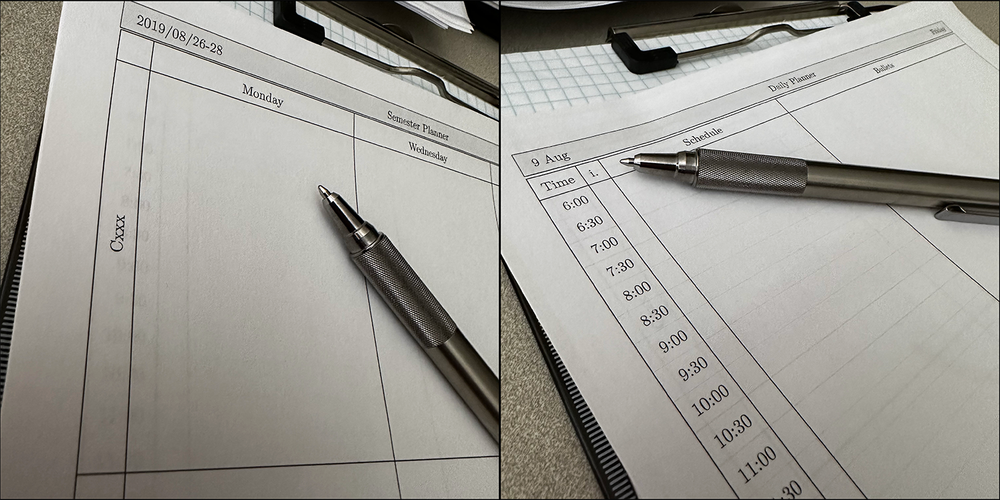
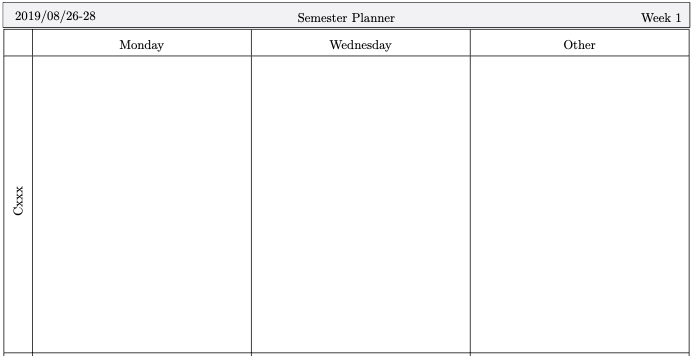
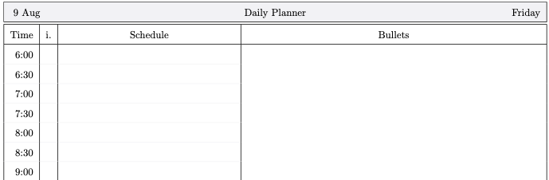
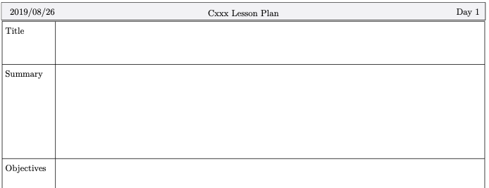

# texlates

Templates for physical note writing.

## Usage

You will need a copy of xetex to execute these templates. This may also require bits of TeXLive, but I'm unsure. I have used `brew install texlive` with success on MacOS.

Run with `-help` first and be sure your startDate is sensible!

## Formats

While three formats are currently in the project, additional templates are relatively easy to add using the directory structure provided. Modify `genearte.go` to add the necessary additions for new templates.

### Class

The class template gives a grid of cells for planning a set of courses that meet twice a week with an extra cell for notes (or another day, I suppose).

With [classExample.pdf](classExample.pdf) for example, Cxx meets on Mondays and Wednesdays starting on 2019-08-26. The week numbers will count as far as generated pages allow. This example was built with:

`./texlates -tpl=class -courses="Cxx,Cyy,Czz" -courseDays="Monday,Wednesday,Other" -pages=16 -start=2019-08-26`

### Daily

The daily template gives a day schedule in half-hour increments with space for free-form notes.

[dailyExample.pdf](dailyExample.pdf) was built using:

`./texlates -tpl=daily -start=2019-08-09 -pages=7`

### Lesson

The lesson plan template follows the two-day schedule of the class template, but gives a full page to design a lecture and assessment for each day.

[lessonExample.pdf](lessonExample.pdf) was generated using:

`./texlates -tpl=lesson -course=Cxxx -start=2019-08-26`